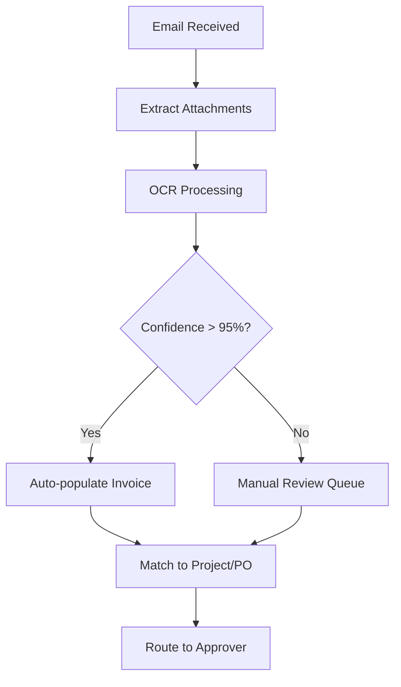
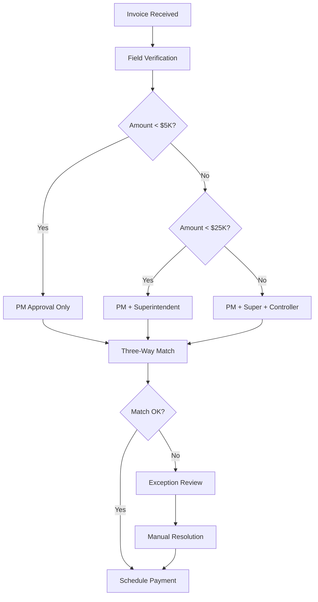
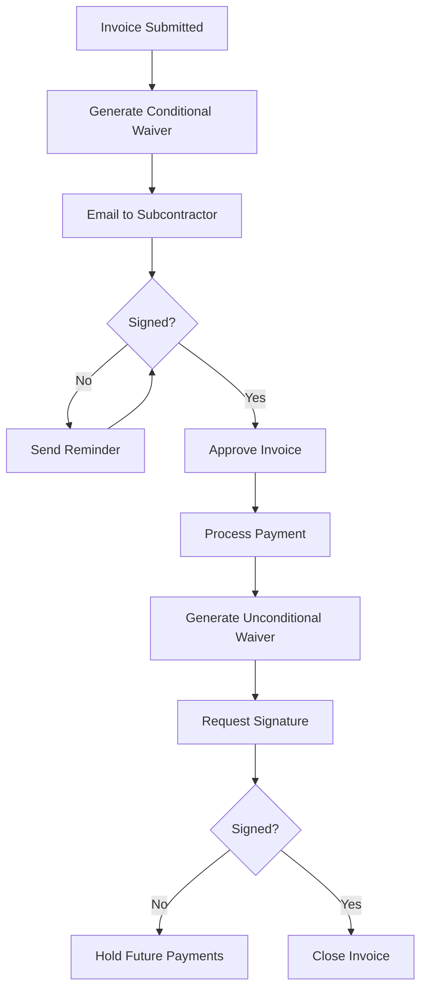

# Subcontractor Invoice Ingestion Research

**Author:** Research Agent
**Date:** 2026-02-03 (Updated)
**Status:** Complete
**Sprint:** 40
**Research ID:** RS-05
**Last Updated:** 2026-02-03

---

## Executive Summary

This document provides comprehensive research on subcontractor invoice ingestion methods for ContractorOS, evaluating current industry practices, integration platforms, and recommended implementation approaches. The research covers how contractors receive invoices, available AP automation platforms, OCR/email capture technologies, and workflow patterns.

### Key Findings

1. **Multi-pathway ingestion is essential** — Contractors receive invoices via email (60%), portals (25%), mail (10%), and accounting software (5%)
2. **Email is the dominant channel** — Most subcontractors still send PDF invoices via email
3. **Portal submission is growing** — Larger GCs are mandating portal-based submission for compliance
4. **Lien waiver collection is critical** — Payment cannot proceed without proper lien waiver documentation
5. **Three-way matching improves accuracy** — Matching PO, receipt, and invoice reduces errors by 50-80%

### Recommended Approach

Implement a **multi-pathway invoice ingestion system** with:
- Dedicated invoice email inbox with OCR parsing
- Self-service subcontractor portal for direct submission
- Integration with Bill.com/Ramp for AP automation
- Automated lien waiver collection workflow
- Configurable approval chains based on amount/project

---

## Table of Contents

1. [Invoice Ingestion Methods](#1-invoice-ingestion-methods)
2. [Platform Integration Comparison](#2-platform-integration-comparison)
3. [Email-Based Invoice Capture](#3-email-based-invoice-capture)
4. [Subcontractor Portal Patterns](#4-subcontractor-portal-patterns)
5. [AP Workflow Requirements](#5-ap-workflow-requirements)
6. [Lien Waiver Collection](#6-lien-waiver-collection)
7. [Retention Handling](#7-retention-handling)
8. [Implementation Recommendations](#8-implementation-recommendations)

---

## 1. Invoice Ingestion Methods

### Current Industry Methods

| Method | Market Share | Pros | Cons |
|--------|--------------|------|------|
| **Email (PDF)** | ~60% | Universal, no training required | Manual processing, easy to lose |
| **Portal Submission** | ~25% | Structured data, compliance tracking | Requires sub onboarding |
| **Physical Mail** | ~10% | Traditional, some subs prefer | Slow, requires scanning/OCR |
| **Accounting Export** | ~5% | Automated, accurate | Requires integration setup |

### Email-Based Submission (Dominant Method)

Most subcontractors submit invoices via email attachment because:
- No portal login required
- Works with their existing workflow
- Can include supporting documentation
- Creates paper trail

**Industry Standard (2026):** Secure, tracked PDF sent via email or client portal establishes a digital timestamp proving exactly when the client received the bill, which is crucial for enforcing 'Net 30' terms.

### Portal-Based Submission (Growing)

Larger general contractors increasingly mandate portal submission for:
- Standardized data capture
- Automated lien waiver collection
- Compliance document tracking
- Audit trail requirements

### Required Invoice Fields for Subcontractors

| Field | Required | Purpose |
|-------|----------|---------|
| Invoice Number | Yes | Unique identifier |
| Invoice Date | Yes | Billing period start |
| Due Date | Yes | Payment timeline |
| Vendor/Sub Name | Yes | Entity verification |
| Legal Entity | Yes | 2026 compliance requirement |
| Project Reference | Yes | Cost allocation |
| Line Items | Yes | Work breakdown |
| Labor vs Materials | Recommended | Tax compliance |
| Retainage Amount | If applicable | Retention tracking |
| Lien Waiver Status | Yes | Payment prerequisite |
| License Number | Recommended | Contractor verification |

---

## 2. Platform Integration Comparison

### AP Automation Platforms

| Platform | API Quality | OCR | Approval Workflow | Construction Focus | Pricing | Recommendation |
|----------|-------------|-----|-------------------|-------------------|---------|----------------|
| **Bill.com** | Excellent | Yes | Yes | Moderate | $45-79/user/mo | Primary AP |
| **Ramp** | Excellent | 99% | Yes | Yes | Free + 2.4% cards | Alternative |
| **Melio** | Good | Yes | Basic | Yes | Free (ACH) | SMB Option |
| **QuickBooks AP** | Limited | No | No | No | Included | Basic only |
| **Xero Bills** | Good | Via Hubdoc | Basic | No | Included | Basic only |

### Detailed Platform Analysis

#### Bill.com (Recommended for AP)

**Key Capabilities:**
- Full REST API (v3) for invoice import/export
- OCR invoice capture via email or upload
- Multi-level approval workflows
- ACH/check/virtual card payments
- QuickBooks/Xero/NetSuite sync
- Vendor portal for invoice status

**API Endpoints:**
```
POST /v3/invoices - Create invoice
GET /v3/invoices/{id} - Get invoice details
POST /v3/invoices/{id}/approve - Approve invoice
POST /v3/invoices/{id}/payment-link - Get payment link
POST /v3/documents - Upload attachments
```

**Integration Pattern:**
```typescript
// Bill.com invoice creation
const createBillComInvoice = async (invoiceData: InvoiceData) => {
  const response = await fetch('https://api.bill.com/v3/invoices', {
    method: 'POST',
    headers: {
      'Authorization': `Bearer ${accessToken}`,
      'Content-Type': 'application/json'
    },
    body: JSON.stringify({
      vendorId: invoiceData.subcontractorId,
      invoiceNumber: invoiceData.number,
      invoiceDate: invoiceData.date,
      dueDate: invoiceData.dueDate,
      amount: invoiceData.total,
      lineItems: invoiceData.lineItems
    })
  });
  return response.json();
};
```

#### Ramp (Best for Cards + AP)

**Key Capabilities:**
- AI-powered invoice coding (85% auto-accuracy)
- 99% OCR accuracy
- Project-aware approval workflows
- Mobile approval support
- Construction-specific features
- Automatic three-way matching

**2026 AI Features:**
- Agents for AP auto-code line items
- Fraud detection
- Approval recommendation engine
- Automatic card payment to vendor portals

**Best For:** GCs wanting card rewards + AP automation combined

#### Melio (Best for SMB)

**Key Capabilities:**
- Free ACH payments
- Email-to-invoice capture via AI-powered Bills Inbox
- Batch payment processing
- Partial payment support
- Multi-currency (16 currencies)
- White-label partner API for embedded solutions

**Construction Features:**
- Partial invoice payments
- Split invoice processing
- Mobile payment management
- Scheduled future payments
- 80% reduction in time handling AP with automation

**Notable Integrations:**
- Amazon Business Reconciliation API (2024)
- Gusto partnership for AP/AR within payroll
- Capital One Business integration
- Shopify merchant dashboard integration

**API:**
```typescript
// Melio white-label integration
const melioConfig = {
  partnerId: 'YOUR_PARTNER_ID',
  webhookUrl: 'https://api.contractoros.com/webhooks/melio',
  capabilities: ['ap', 'ar', 'payments']
};
```

**2025 Recognition:** Melio won Wealth & Finance International Magazine's 2025 FinTech Award for best SMB Payment Solutions Platform in the U.S.

#### Brex (Unified Spend Platform)

**Key Capabilities:**
- LLM-powered invoice scanning (90%+ accuracy)
- Payments API and Expenses API
- Multi-level approval workflows with thresholds
- Virtual cards for one-time vendor payments
- ACH, wire, virtual cards, and check payments

**API Endpoints:**
```
GET /vendors - List all existing vendors
POST /vendors - Create new vendor
PUT /vendors/{id} - Update vendor
DELETE /vendors/{id} - Delete vendor
POST /transfers - Initiate payment transfer
GET /transfers/{id}/status - View transfer status
```

**ERP Integration:**
- Automatic vendor sync with QuickBooks Online, NetSuite, Xero
- Bill data sync creates/matches vendors in ERP
- Two-way accounting integration for PO matching

### Accounting Software Native AP

| Software | Invoice Import | Approval Workflow | Limitations |
|----------|----------------|-------------------|-------------|
| **QuickBooks Online** | Manual entry only | None built-in | No OCR, no routing |
| **Xero** | Via Hubdoc | Basic | Limited automation |
| **Sage Intacct** | Good | Yes | Construction-specific modules |
| **NetSuite** | Excellent | Yes | Enterprise pricing |

**Xero API Note:** New API pricing starts March 2026. Rate limit: 5,000 calls/day per organization. Bulk operations support up to 50 invoices per request.

**Recommendation:** Use dedicated AP tool (Bill.com/Ramp) + sync to accounting software

---

## 3. Email-Based Invoice Capture

### Email Inbox Automation Pattern

**Setup:**
1. Create dedicated email: `invoices@company.com`
2. Connect to OCR service
3. Extract invoice data automatically
4. Route to approval workflow

### OCR Service Comparison

| Service | Accuracy | Speed | API | Pricing |
|---------|----------|-------|-----|---------|
| **Nanonets** | 95-99% | 1-2 sec | REST | $0.10/page |
| **Mindee** | 95-99% | 1-2 sec | REST | $0.10/page |
| **AWS Textract** | 90-95% | 2-3 sec | SDK | $0.015/page |
| **Google Document AI** | 90-95% | 2-3 sec | SDK | $0.010/page |
| **Bill.com OCR** | 95%+ | 2-3 sec | Included | With subscription |

### Cost Comparison

| Processing Method | Cost per Invoice | Time per Invoice |
|-------------------|------------------|------------------|
| Manual Entry | $12-22.75 | 10-30 min |
| Basic OCR | $2-3 | 1-2 min (review) |
| AI-Augmented OCR | $2.36 | 1-2 sec |

**Industry Benchmarks:**
- Average manual invoice processing cost: $22.75 (2026 data)
- Parseur customers save ~152 hours/month (~$7,000/month)
- Automation is approximately 98% cheaper than manual entry
- Annual savings potential: $80,000+ for mid-size contractors

### Email Parsing Services Comparison

| Service | Approach | Key Features | Integrations |
|---------|----------|--------------|--------------|
| **Parseur** | AI + OCR | Table/line item extraction, no-code | Google Sheets, CRM, webhooks |
| **Mailparser** | Rule-based | Attachment parsing, multiple export formats | Zapier, Excel, CSV, JSON, XML |
| **Airparser** | LLM-powered | Receipts, invoices, contracts | Custom workflows |
| **Parserr** | AI parsing | Invoice data extraction | Various CRM/accounting |

**Parseur Advantage:** Easily extracts data from tables irrespective of line item count - essential for construction invoices with multiple line items.

### Email Parsing Workflow



### Implementation Code Pattern

```typescript
// Email invoice parsing service
interface ParsedInvoice {
  vendorName: string;
  invoiceNumber: string;
  invoiceDate: Date;
  dueDate: Date;
  lineItems: LineItem[];
  total: number;
  confidence: number;
}

const parseInvoiceEmail = async (email: Email): Promise<ParsedInvoice> => {
  // Extract PDF attachments
  const attachments = email.attachments.filter(
    a => a.mimeType === 'application/pdf'
  );

  // Send to OCR service
  const ocrResult = await ocrService.process(attachments[0]);

  // Extract structured data
  return {
    vendorName: ocrResult.fields.vendor_name,
    invoiceNumber: ocrResult.fields.invoice_number,
    invoiceDate: parseDate(ocrResult.fields.invoice_date),
    dueDate: parseDate(ocrResult.fields.due_date),
    lineItems: ocrResult.fields.line_items,
    total: parseFloat(ocrResult.fields.total),
    confidence: ocrResult.overall_confidence
  };
};
```

---

## 4. Subcontractor Portal Patterns

### Industry Leader: Procore

**Portal Workflow:**
1. Invoice administrator creates billing period
2. Sends "Invite to Bill" to subcontractor contacts
3. Sub logs in and creates invoice against commitment
4. Attaches supporting documentation
5. Submits for review (status: "Under Review")
6. GC reviews and approves/rejects
7. Lien waiver generated with invoice
8. Payment processed via Procore Pay

**Key Features:**
- Commitment-based invoicing
- Schedule of values tracking
- Change order integration
- Lien waiver automation
- Workflow routing by amount/field

### Self-Service Portal Requirements

| Feature | Priority | Description |
|---------|----------|-------------|
| **Magic Link Access** | P0 | No password required, email-based |
| **Invoice Upload** | P0 | PDF upload with OCR pre-fill |
| **Line Item Entry** | P0 | Match to contract SOV |
| **Supporting Docs** | P0 | Attach receipts, delivery tickets |
| **Lien Waiver Signing** | P0 | E-signature integration |
| **Status Tracking** | P1 | View approval progress |
| **Payment History** | P1 | Past payments and retainage |
| **Message Thread** | P2 | Communicate with GC AP |

### Portal Data Model

```typescript
interface SubcontractorInvoice {
  id: string;
  subcontractorId: string;
  projectId: string;
  commitmentId: string;

  // Invoice Details
  invoiceNumber: string;
  invoiceDate: Timestamp;
  periodStart: Timestamp;
  periodEnd: Timestamp;
  dueDate: Timestamp;

  // Financial
  previouslyBilled: number;
  currentBilled: number;
  storedMaterials: number;
  retainageHeld: number;
  retainageReleased: number;
  totalDue: number;

  // Line Items (match to SOV)
  lineItems: InvoiceLineItem[];

  // Compliance
  lienWaiverType: 'conditional' | 'unconditional';
  lienWaiverId?: string;
  lienWaiverSigned: boolean;
  lienWaiverSignedAt?: Timestamp;

  // Attachments
  attachments: Attachment[];

  // Workflow
  status: 'draft' | 'submitted' | 'under_review' | 'approved' | 'rejected' | 'paid';
  submittedAt?: Timestamp;
  submittedBy?: string;
  currentApprover?: string;
  approvalHistory: ApprovalEvent[];

  // AIA Format
  aiaG702Data?: AIAG702;
  aiaG703Data?: AIAG703[];
}

interface InvoiceLineItem {
  id: string;
  sovLineId: string;
  description: string;
  scheduledValue: number;
  previouslyCompleted: number;
  currentCompleted: number;
  storedMaterials: number;
  totalCompletedAndStored: number;
  percentComplete: number;
  retainageHeld: number;
}
```

### AIA G702/G703 Support

**G702 (Application and Certificate for Payment):**
- Cover page summarizing contract value
- Total work completed
- Retainage held
- Previous payments
- Current amount requested
- Contractor and architect signatures

**G703 (Continuation Sheet):**
- Detailed schedule of values breakdown
- Work completed per line item
- Stored materials tracking
- Cumulative totals
- Balance to finish

```typescript
interface AIAG702 {
  applicationNumber: number;
  periodTo: Date;
  contractorName: string;
  projectName: string;
  contractSum: number;
  changeOrdersTotal: number;
  contractToDate: number;
  completedToDate: number;
  storedMaterialsNotIncorporated: number;
  totalCompletedAndStored: number;
  retainagePercent: number;
  retainageAmount: number;
  lessRetainage: number;
  totalEarnedLessRetainage: number;
  previousCertificates: number;
  currentPaymentDue: number;
  balanceToFinish: number;
}
```

---

## 5. AP Workflow Requirements

### Approval Chain Patterns

**Construction-Specific Approval Flow:**



### Role-Based Approval Matrix

| Invoice Amount | Required Approvers | Estimated Time |
|----------------|-------------------|----------------|
| < $500 | Auto-approve or Project Coordinator | Same day |
| $500 - $1,000 | Project Coordinator | 1 day |
| $1,000 - $5,000 | Project Manager | 1-2 days |
| $5,000 - $25,000 | PM + Superintendent | 2-3 days |
| $25,000 - $100,000 | PM + Super + Controller | 3-5 days |
| > $100,000 | PM + Super + Controller + CFO | 5-7 days |

**Linear Escalation Logic:**
When an invoice enters a linear approval workflow step, the system checks the monetary limit of the first user. If the invoice exceeds their limit, they must approve and the invoice escalates to their manager. This continues until it reaches someone whose limit is >= invoice amount.

**Multi-Tier Benefits:**
- Distributes accountability across organization
- Ensures proper oversight at each level
- Prevents single individual control (segregation of duties)
- Minimizes risk of errors or fraudulent activities

### Three-Way Matching

**Definition:** Verifying that purchase order, receiving report, and invoice match before payment.

**Benefits:**
- Prevents overpayment
- Catches duplicate invoices
- Validates work completion
- Reduces fraud risk

**Implementation:**

```typescript
interface ThreeWayMatch {
  // Purchase Order
  poNumber: string;
  poAmount: number;
  poLineItems: POLineItem[];

  // Receipt/Delivery
  receiptDate: Date;
  receivedBy: string;
  deliveryTicketNumber: string;
  quantityReceived: number;

  // Invoice
  invoiceNumber: string;
  invoiceAmount: number;
  invoiceLineItems: InvoiceLineItem[];

  // Match Result
  matchStatus: 'matched' | 'partial' | 'exception';
  varianceAmount: number;
  variancePercent: number;
  toleranceExceeded: boolean;
  matchDetails: MatchDetail[];
}

const performThreeWayMatch = (
  po: PurchaseOrder,
  receipt: Receipt,
  invoice: Invoice
): ThreeWayMatch => {
  const tolerance = 0.02; // 2% variance allowed

  const varianceAmount = Math.abs(invoice.total - po.total);
  const variancePercent = varianceAmount / po.total;

  return {
    poNumber: po.number,
    poAmount: po.total,
    poLineItems: po.lineItems,
    receiptDate: receipt.date,
    receivedBy: receipt.receivedBy,
    deliveryTicketNumber: receipt.ticketNumber,
    quantityReceived: receipt.quantity,
    invoiceNumber: invoice.number,
    invoiceAmount: invoice.total,
    invoiceLineItems: invoice.lineItems,
    matchStatus: variancePercent <= tolerance ? 'matched' : 'exception',
    varianceAmount,
    variancePercent,
    toleranceExceeded: variancePercent > tolerance,
    matchDetails: compareLineItems(po.lineItems, invoice.lineItems)
  };
};
```

### Workflow Automation Rules

| Trigger | Action | Notification |
|---------|--------|--------------|
| Invoice submitted | Route to first approver | Email + in-app |
| Approval pending > 2 days | Send reminder | Email |
| Amount exceeds threshold | Add additional approver | In-app |
| Three-way match fails | Route to exception queue | Email to AP manager |
| All approvals complete | Schedule payment | Email to vendor |
| Payment processed | Update status | Email to all parties |

---

## 6. Lien Waiver Collection

### Lien Waiver Types

| Type | When Used | Legal Effect |
|------|-----------|--------------|
| **Conditional Progress** | Before payment received | Waives rights only if payment clears |
| **Unconditional Progress** | After payment received | Immediately waives rights |
| **Conditional Final** | Before final payment | Waives all rights if final payment clears |
| **Unconditional Final** | After final payment | Immediately waives all rights |

### State-Specific Requirements

Different states have statutory lien waiver forms:
- California, Texas, Arizona, Georgia, Michigan, etc.
- Some states require specific language
- Invalid forms may not protect against liens

### Lien Waiver Management Platforms

| Platform | E-Signature | Auto-Generation | State Templates | Key Differentiator | Pricing |
|----------|-------------|-----------------|-----------------|-------------------|---------|
| **Siteline** | Yes | Yes | Yes | 3 weeks faster payments, ~1 week/month saved | Contact |
| **Oracle Textura** | Yes | Yes | Yes | Enterprise compliance, sub-tier collection | Enterprise |
| **Beam** | Yes | Yes | Yes | Zero manual data entry, bulk vendor emails | $199+/mo |
| **TrustLayer** | Yes | Yes | Yes | Fillable/printable waivers, automated reminders | Contact |
| **Rabbet** | Yes | Yes | Yes | AI document router, central inbox | Construction lenders |
| **Built** | Yes | Yes | Yes | No duplicate entry, bulk reminder sending | Contact |
| **Adaptive** | Yes | Yes | Yes | Frictionless signing (no account required) | Contact |
| **Trimble Pay** | Yes | Yes | Yes | Combined pay apps + lien waivers | Contact |
| **Levelset** | Yes | Yes | Yes | Preliminary notice automation | $49+/mo |

### Lien Waiver Workflow



### Implementation Pattern

```typescript
interface LienWaiver {
  id: string;
  invoiceId: string;
  subcontractorId: string;
  projectId: string;

  // Waiver Details
  waiverType: 'conditional_progress' | 'unconditional_progress' |
              'conditional_final' | 'unconditional_final';
  state: string;
  templateId: string;

  // Amounts
  throughDate: Date;
  paymentAmount: number;
  exceptionsAmount?: number;
  exceptionsDescription?: string;

  // Signature
  signatureRequired: boolean;
  signedAt?: Timestamp;
  signedBy?: string;
  signatureUrl?: string;

  // Status
  status: 'pending' | 'signed' | 'expired' | 'invalid';
  sentAt: Timestamp;
  remindersSent: number;
  lastReminderAt?: Timestamp;

  // Document
  documentUrl?: string;
  signedDocumentUrl?: string;
}

// Auto-generate lien waiver with invoice
const generateLienWaiver = async (
  invoice: SubcontractorInvoice,
  project: Project,
  sub: Subcontractor
): Promise<LienWaiver> => {
  const stateTemplate = await getStateTemplate(project.state);

  return {
    id: generateId(),
    invoiceId: invoice.id,
    subcontractorId: sub.id,
    projectId: project.id,
    waiverType: invoice.isFinal ? 'conditional_final' : 'conditional_progress',
    state: project.state,
    templateId: stateTemplate.id,
    throughDate: invoice.periodEnd,
    paymentAmount: invoice.totalDue,
    signatureRequired: true,
    status: 'pending',
    sentAt: Timestamp.now(),
    remindersSent: 0
  };
};
```

---

## 7. Retention Handling

### Retention/Retainage Overview

**Definition:** 5-10% of each payment withheld until project completion to ensure contractor/sub completes work satisfactorily.

### Accounting Treatment

**Accounts Payable Retention:**
- Recorded when paying subcontractors
- Separate from regular AP
- Released upon project completion

**Accounts Receivable Retention:**
- Recorded when billing owner
- Separate from regular AR
- Collected after substantial completion

### Retention Tracking Model

```typescript
interface RetentionTracking {
  id: string;
  subcontractorId: string;
  projectId: string;
  commitmentId: string;

  // Retention Settings
  retentionPercent: number; // typically 5-10%
  releaseThreshold: number; // % complete to reduce retention
  reducedRetentionPercent?: number; // lower % after threshold

  // Cumulative Amounts
  totalBilled: number;
  totalRetentionHeld: number;
  totalRetentionReleased: number;
  retentionBalance: number;

  // Release Schedule
  releaseType: 'at_completion' | 'at_threshold' | 'per_phase';
  releaseSchedule?: ReleaseScheduleItem[];

  // Status
  status: 'holding' | 'partial_release' | 'fully_released';
  lastUpdated: Timestamp;
}

interface ReleaseScheduleItem {
  milestone: string;
  releasePercent: number;
  releasedAt?: Timestamp;
  amount: number;
}
```

### Invoice Line Item with Retention

```typescript
// Example: Recording retention on subcontractor bill
const recordSubInvoiceWithRetention = (
  invoice: SubcontractorInvoice,
  retentionPercent: number
) => {
  const lineItems = invoice.lineItems.map(item => ({
    ...item,
    retentionHeld: item.currentCompleted * retentionPercent,
    netPayable: item.currentCompleted * (1 - retentionPercent)
  }));

  return {
    ...invoice,
    lineItems,
    retentionHeld: lineItems.reduce((sum, li) => sum + li.retentionHeld, 0),
    netPayable: lineItems.reduce((sum, li) => sum + li.netPayable, 0)
  };
};
```

### State Retention Laws

| State | Max Retention | Release Deadline | Notes |
|-------|---------------|------------------|-------|
| California | 5% | 45 days after completion | Penalties for late release |
| Texas | 10% | 30 days after completion | Statutory requirements |
| Florida | 5-10% | Per contract | Follow prompt pay act |
| New York | 5% | 30 days | Public works specific rules |
| Nevada | 5% | Per agreement | May not exceed 5% by law |
| North Dakota | 10% until 50% | 50% complete threshold | No more retention after 50% |

**Important Considerations:**
- Profit margins on construction often run 5-10%, meaning retainage can equal entire project profit
- Subcontractors are most impacted as they're at bottom of payment chain
- GCs may impose higher retention on subs (8-10%) than what they face from owners (5%)
- Variable retainage (e.g., 10% dropping to 5% at 50% complete) is increasingly common

---

## 8. Implementation Recommendations

### Recommended Multi-Pathway Architecture

```
                    ┌─────────────────────┐
                    │   ContractorOS      │
                    │   Invoice Hub       │
                    └─────────┬───────────┘
                              │
        ┌─────────────────────┼─────────────────────┐
        │                     │                     │
        ▼                     ▼                     ▼
┌───────────────┐   ┌─────────────────┐   ┌─────────────────┐
│ Email Inbox   │   │ Sub Portal      │   │ AP Integration  │
│ (OCR Parse)   │   │ (Direct Entry)  │   │ (Bill.com/Ramp) │
└───────┬───────┘   └────────┬────────┘   └────────┬────────┘
        │                    │                     │
        └────────────────────┼─────────────────────┘
                             │
                             ▼
                    ┌─────────────────┐
                    │ Invoice Queue   │
                    │ (Unified View)  │
                    └────────┬────────┘
                             │
                             ▼
                    ┌─────────────────┐
                    │ Three-Way Match │
                    │ (PO/Receipt/Inv)│
                    └────────┬────────┘
                             │
                             ▼
                    ┌─────────────────┐
                    │ Approval        │
                    │ Workflow        │
                    └────────┬────────┘
                             │
                             ▼
                    ┌─────────────────┐
                    │ Lien Waiver     │
                    │ Collection      │
                    └────────┬────────┘
                             │
                             ▼
                    ┌─────────────────┐
                    │ Payment         │
                    │ Processing      │
                    └────────┬────────┘
                             │
                             ▼
                    ┌─────────────────┐
                    │ Accounting Sync │
                    │ (QBO/Xero)      │
                    └─────────────────┘
```

### Phase 1: Core Invoice Ingestion (Sprint 41-42)

**Features:**
1. Subcontractor invoice data model
2. Manual invoice entry form
3. PDF upload with basic OCR
4. Invoice status tracking
5. Simple approval workflow

**Firestore Collections:**
```
organizations/{orgId}/subcontractorInvoices/{invoiceId}
organizations/{orgId}/invoiceApprovals/{approvalId}
```

### Phase 2: Subcontractor Portal (Sprint 43-44)

**Features:**
1. Magic link portal access
2. Invoice submission form
3. Supporting document upload
4. Status tracking for subs
5. Message thread with GC

### Phase 3: Lien Waiver Integration (Sprint 45)

**Features:**
1. State-specific templates
2. Auto-generation with invoice
3. E-signature integration
4. Reminder automation
5. Compliance tracking

### Phase 4: AP Platform Integration (Sprint 46-47)

**Features:**
1. Bill.com or Ramp integration
2. Two-way sync
3. Payment processing
4. Accounting sync

### API Integration Priority

| Integration | Priority | Complexity | Value |
|-------------|----------|------------|-------|
| Bill.com | P1 | Medium | High |
| Ramp | P2 | Medium | High |
| Procore | P3 | High | Medium |
| Melio | P3 | Low | Medium |

### Estimated Development Effort

| Phase | Sprints | Dev Days | Features |
|-------|---------|----------|----------|
| Phase 1 | 2 | 10 | Core data model, forms, workflow |
| Phase 2 | 2 | 12 | Portal, magic links, uploads |
| Phase 3 | 1 | 6 | Lien waivers, e-signature |
| Phase 4 | 2 | 10 | Bill.com, sync, payments |
| **Total** | **7** | **38** | **Full AP automation** |

---

## References

### AP Automation Platforms
- [Bill.com Developer Documentation](https://developer.bill.com/)
- [Bill.com API Overview](https://www.bill.com/product/api)
- [Ramp AP Automation for Construction](https://ramp.com/blog/ap-automation-software/construction)
- [Ramp Agents for AP](https://ramp.com/blog/ramp-ap-agents-announcement)
- [Melio Construction AP](https://meliopayments.com/industries/construction/)
- [Melio Partner API](https://meliopayments.com/partners/)

### Invoice Processing
- [Bill.com Invoice Capture](https://www.bill.com/learning/invoice-capture)
- [Bill.com OCR Processing](https://www.bill.com/learning/ocr-invoice-processing)
- [Procore Subcontractor Invoices](https://support.procore.com/products/online/user-guide/project-level/invoicing/tutorials/about-subcontractor-invoices)
- [Procore Invoice Submission](https://support.procore.com/products/online/user-guide/project-level/commitments/tutorials/submit-a-new-invoice-as-an-invoice-contact)

### Three-Way Matching
- [Corcentric Three-Way Match](https://www.corcentric.com/source-to-pay/ap-automation/approval-workflow/three-way-match/)
- [DocuWare Invoice Matching](https://start.docuware.com/blog/document-management/3-way-invoice-matching)
- [Stampli 3-Way Matching Guide](https://www.stampli.com/blog/invoice-management/3-way-invoice-matching/)

### Lien Waiver Management
- [Built Lien Waiver Management](https://getbuilt.com/features/lien-waiver-management/)
- [Siteline Lien Waiver Software](https://www.siteline.com/feature/lien-waiver-management-software)
- [Beam Lien Waiver Management](https://www.trybeam.com/lien-waiver-management)
- [Procore Lien Waivers](https://support.procore.com/products/online/user-guide/company-level/payments/faq/what-is-a-lien-waiver)

### Construction Invoicing
- [2026 Guide to AIA Billing](https://archdesk.com/blog/2026-guide-to-aia-billing)
- [AIA G702/G703 Guide](https://www.procore.com/library/aia-g702-application-for-payment)
- [2026 Contractor Invoicing Compliance](https://myinvoicetemplate.com/resources/invoicing-guide-for-contractors/)
- [Construction Invoicing Guide](https://www.mastt.com/guide/construction-invoicing)

### Retention Handling
- [NetSuite Retainage Guide](https://www.netsuite.com/portal/resource/articles/accounting/retainage.shtml)
- [Levelset Retention Accounting](https://www.levelset.com/blog/accounting-retention-receivable-payable/)
- [RedHammer AP Retention](https://www.redhammer.io/blog/how-to-manage-ap-retention-in-the-construction-sector-an-overview)

### Accounting Integration
- [QuickBooks AP Automation](https://ramp.com/blog/ap-software-compatible-with-quickbooks)
- [Xero AP Automation](https://www.procuredesk.com/xero-accounts-payable-automation/)
- [Xero Invoices API](https://developer.xero.com/documentation/api/accounting/invoices)

### Email Parsing Services
- [Mailparser Invoice Data Capture](https://mailparser.io/blog/invoice-data-capture-software/)
- [Parseur Invoice Processing](https://parseur.com/use-case/invoice-processing)
- [Parseur Invoice Data Capture Guide](https://parseur.com/blog/invoice-data-capture)

### Brex Integration
- [Brex API Overview](https://developer.brex.com/)
- [Brex Payments API](https://developer.brex.com/openapi/payments_api/)
- [Brex Bill Pay](https://www.brex.com/product/bill-pay)

---

## Appendix A: Subcontractor Invoice Checklist

### Required for Payment
- [ ] Valid invoice number
- [ ] Invoice date and billing period
- [ ] Legal entity name matching license
- [ ] Project/job reference
- [ ] Line items matching SOV
- [ ] Labor and materials separated
- [ ] Correct retainage calculation
- [ ] Signed conditional lien waiver
- [ ] Supporting documentation (if required)
- [ ] Insurance certificates current
- [ ] License verification

### Supporting Documents (As Needed)
- [ ] Delivery tickets
- [ ] Time sheets
- [ ] Material receipts
- [ ] Photos of completed work
- [ ] Inspection reports
- [ ] Change order backup

---

## Appendix B: Approval Workflow Configuration

```typescript
// Example approval workflow configuration
const invoiceApprovalWorkflow = {
  name: 'Standard Invoice Approval',
  rules: [
    {
      condition: 'invoice.amount < 1000',
      approvers: ['project_coordinator'],
      escalationDays: 2
    },
    {
      condition: 'invoice.amount >= 1000 && invoice.amount < 5000',
      approvers: ['project_manager'],
      escalationDays: 2
    },
    {
      condition: 'invoice.amount >= 5000 && invoice.amount < 25000',
      approvers: ['project_manager', 'superintendent'],
      approvalType: 'all', // all must approve
      escalationDays: 3
    },
    {
      condition: 'invoice.amount >= 25000',
      approvers: ['project_manager', 'superintendent', 'controller'],
      approvalType: 'all',
      escalationDays: 5
    }
  ],
  notifications: {
    onSubmit: ['approvers', 'submitter'],
    onApprove: ['next_approver', 'submitter'],
    onReject: ['submitter', 'project_manager'],
    onPaid: ['submitter', 'subcontractor']
  }
};
```

---

---

## Appendix C: AIA G702/G703 Field Reference

### G702 - Application and Certificate for Payment (Cover Page)

The G702 is the summary page that acts as both the contractor's payment application and the architect's certification of amount due.

| Field | Description | Maps To |
|-------|-------------|---------|
| Application No. | Sequential billing number | `billingPeriodNumber` |
| Period To | End date of billing period | `billingPeriodEnd` |
| Contract Date | Original contract execution date | `commitment.executedDate` |
| Project | Project name and location | `project.name` |
| Contract For | Description of work | `commitment.description` |
| Contractor | Subcontractor name and address | `subcontractor.name` |
| Original Contract Sum | Initial contract value | `commitment.originalAmount` |
| Net Change by COs | Total of approved change orders | `commitment.changeOrderTotal` |
| Contract Sum to Date | Current contract value | `commitment.currentAmount` |
| Total Completed & Stored | Work + stored materials to date | `invoice.totalCompleted` |
| Retainage | Amount withheld | `invoice.retainageAmount` |
| Total Earned Less Retainage | Net earned amount | Calculated |
| Less Previous Certificates | Prior approved amounts | Calculated |
| Current Payment Due | This application amount | `invoice.netPayable` |
| Balance to Finish | Remaining contract value | Calculated |

### G703 - Continuation Sheet (Schedule of Values Detail)

The G703 breaks down each line item from the schedule of values with current billing amounts.

| Column | Letter | Description | Maps To |
|--------|--------|-------------|---------|
| Item No. | A | Line item identifier | `lineItem.id` |
| Description of Work | B | Work scope description | `lineItem.description` |
| Scheduled Value | C | Original contract amount for line | `lineItem.scheduledValue` |
| Work Completed - Previous | D | Prior applications total | `lineItem.previousCompleted` |
| Work Completed - This Period | E | Current billing amount | `lineItem.currentCompleted` |
| Materials Presently Stored | F | On-site materials not installed | `lineItem.materialsStored` |
| Total Completed & Stored | G | D + E + F | `lineItem.totalCompleted` |
| % Complete | H | G / C | `lineItem.percentComplete` |
| Balance to Finish | I | C - G | `lineItem.balanceToFinish` |
| Retainage | J | Retention held on line | `lineItem.retainage` |

**Common Mistakes to Avoid:**
1. Math errors between G702 totals and G703 line items
2. Missing lien waivers holding up payment
3. Late submissions pushing payment to next cycle (30-60 days delay)
4. Incorrect retainage calculations

---

## Appendix D: QuickBooks AP Extensions Comparison

For contractors using QuickBooks, these extensions add AP automation capabilities:

| Extension | OCR | Approval Workflow | 3-Way Match | PO Sync | Pricing |
|-----------|-----|-------------------|-------------|---------|---------|
| **Stampli** | AI-powered | Yes, policy-based | Yes | Real-time | Gold Partner |
| **Ottimate** | Automatic | Yes | Yes | API-based | Contact |
| **MineralTree** | Yes | Yes | Yes | Two-way | Contact |
| **Tipalti** | AI OCR | Yes | Yes | Yes | Contact |
| **Quadient AP** | SmartCoding | Yes | Yes | Yes | Contact |
| **ProcureDesk** | AI extraction | Yes | Yes | Real-time | Contact |

**Key Capabilities Across Extensions:**
- OCR/AI invoice capture with automatic data extraction
- Approval workflows with electronic push approvals
- 2-way and 3-way PO matching
- Bidirectional real-time sync with QuickBooks
- Vendor self-service portals for onboarding

**Important:** QuickBooks native AP only supports uploading and paying bills - no approval workflow or invoice capture capabilities are built in.

---

*Document generated by ContractorOS Research Agent - 2026-02-03*
*Updated with latest platform research - 2026-02-03*
